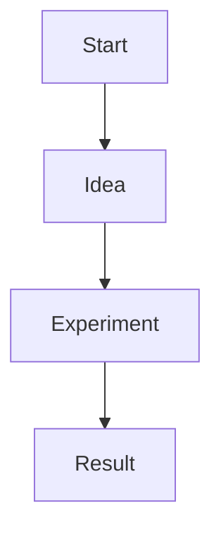

# Syntax

## Headings

# H1 Title

## H2 Section

### H3 Subsection

#### H4

##### H5

# H6

---

## Paragraph

This is a normal paragraph.

This is another paragraph separated by a blank line.

Line break example:
Hello
World

---

## Text Formatting

*italic text*

**bold text**

***bold italic***

~~strikethrough~~

`inline code`

---

## Lists

### Unordered List

* apple
* banana
* orange

### Nested List

* AI

  * LLM
  * Vision
  * Robotics

### Ordered List

1. first
2. second
3. third

---

## Links

[OpenAI](https://openai.com)

Reference style link:

[OpenAI Reference][1]

# Embedded YouTube Video


---

## Images


---

## Blockquote

> This is a quote

Nested quote:

> Level 1
>
> > Level 2

---

## Code Blocks

Inline code example: `print("hello")`

### Python

```python
print("hello world")
for i in range(3):
    print(i)
```

### JavaScript

```javascript
function greet() {
  console.log("hello");
}
greet();
```

### Diff Example

```diff
+ added line
- removed line
```

---

## Tables

| Name  | Age |
| ----- | --- |
| Alice | 20  |
| Bob   | 25  |

Alignment example:

| Left | Center | Right |
| :--- | :----: | ----: |
| A    |    B   |     C |
| D    |    E   |     F |

---

## Task List

* [x] finished task
* [ ] unfinished task
* [ ] another task

---

## Horizontal Rule

---

---

---

## Footnotes

Here is a sentence with a footnote.[^1]

[^1]: This is the footnote text.

---

## Math (if supported)

Inline math: $E = mc^2$

Block math:

$$
\int_0^\infty x^2 dx
$$

---

## HTML inside Markdown

<div style="color:red">
This text uses raw HTML styling.
</div>

---

## Collapsible Section

<details>
<summary>Click to expand</summary>

Hidden content inside the collapsible section.

</details>

---

## Definition List (not supported everywhere)

Term
: Definition of the term

---

## Emoji

🚀 🧠 📚 😄

---

## Keyboard Keys

Press `Ctrl + C` to copy.

---

## Diagram (Mermaid if supported)



---

## Metadata / Frontmatter (for blog engines)

```
---
title: Markdown Test
date: 2026-03-06
tags: [markdown, test]
---
```

---

## Sample Homepage Section

# Hi, I'm Ope

I build experiments in AI and interfaces.

## Projects

* AI Memory System
* Gesture Mouse
* Tiny LLM experiments

## Notes

* Transformer ideas
* TTS experiments
* UI design thoughts

## Contact

GitHub • Email

---


## Long Header Table Test

| Extremely Long Header Name That Might Cause Layout Overflow Problems In Some Markdown Renderers                                                                                            | Another Very Long Column Header That Keeps Going And Going Without Stopping                                                                                                       | Short |
| ------------------------------------------------------------------------------------------------------------------------------------------------------------------------------------------ | --------------------------------------------------------------------------------------------------------------------------------------------------------------------------------- | ----- |
| This is a very very very long text inside a table cell that might wrap across multiple lines depending on how the CSS of the markdown renderer is configured                               | Another extremely long piece of content that could potentially break the layout if the table does not support proper word wrapping or overflow handling                           | ok    |
| Short text                                                                                                                                                                                 | This column contains a long description explaining something in detail to test how the markdown renderer deals with content that exceeds the typical width of the table container | ok    |
| This cell contains a paragraph-sized text to test whether the table will stretch the page width or keep the layout constrained inside the markdown container which is usually around 700px | short                                                                                                                                                                             | ok    |

---

## Ultra Wide Table Test

| Column With A Ridiculously Long Name Designed To Break Layout                             | Another Column With Even Longer Header Text That Might Cause Horizontal Scrolling In Some Markdown Implementations | Yet Another Column With A Long Header | Final Column |
| ----------------------------------------------------------------------------------------- | ------------------------------------------------------------------------------------------------------------------ | ------------------------------------- | ------------ |
| long long long long long long long long long long long long long long long long long long | more long long long long long long long long long long long text                                                   | medium                                | ok           |
| medium text                                                                               | medium text                                                                                                        | medium text                           | ok           |
| short                                                                                     | short                                                                                                              | short                                 | ok           |

---

## Single Column Stress Test

| Extremely Long Header That Probably Should Wrap But Sometimes Does Not In Basic Markdown CSS                                                                                                                                     |
| -------------------------------------------------------------------------------------------------------------------------------------------------------------------------------------------------------------------------------- |
| This is a very long paragraph placed inside a single table cell to test whether the renderer will wrap the text, overflow the container, or break the layout completely depending on the CSS rules applied to the table element. |

